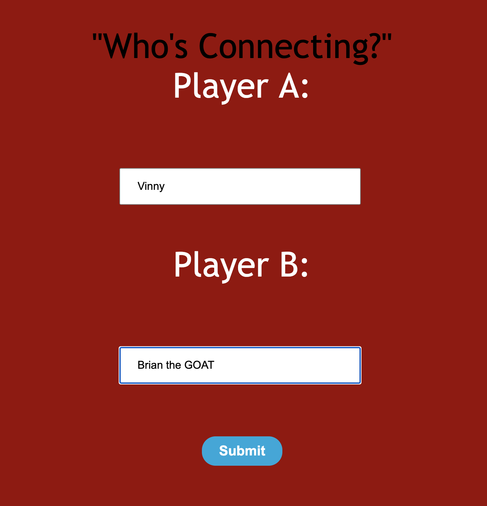
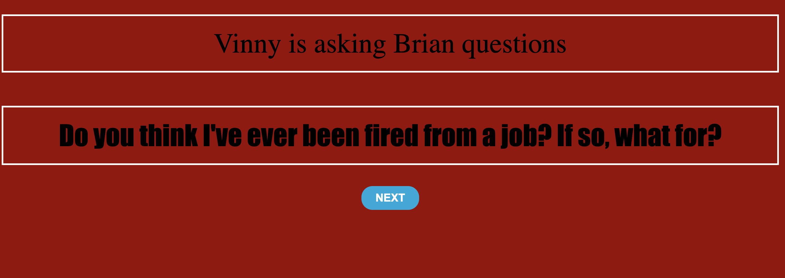
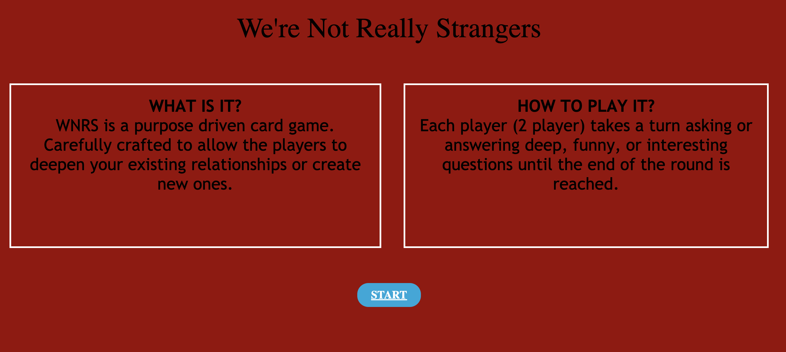

# TITLE: WE'RE NOT REALLY STRANGERS

# HOW TO PLAY
##  STRUCTURE OF THE GAME 
The game is pretty straight forward, hit START to move on to a page for both players to add their NAMES. The game isn't about winning but the official purpose is to build better connections with people besides asking about their jobs, weather, or hobbies. 

Player A starts asking Player B, and Player B responds verbally (no input field). Once next button is clicked, the script flips and it's player B asking the question and player A answers.

---

# Start Up Screen:

---

# HOW TO INSTALL

## Example
1. *`Fork`* and *`Clone`* this respository to your local machine
2. Open `index.html` in your browser to play  

---
# HOW IT WORKS
We're not really strangers is a purpose driven card game. Originally it had 3 levels that 
allow you to deepen your existing relationships and create new ones. 

But I made it into 1 level for now.

Each player (2 player) takes a turn asking or answering deep, funny, or interesting questions until the end of the round is reach, if you want you can pass the phone to 2 other people and start over!

---

# CODE SNIPPET
`function navArray() {
        let i = 0;
        let notification = document.createElement("P")
        notification.setAttribute("class", "notification")
        notification.innerText = `${playerAResult} is asking ${playerBResult} questions`
        document.body.prepend(notification)
            //create a P tag with DOM manipulation
        let pTag = document.createElement("P");
        pTag.setAttribute("class", "pTag")
        let pTagLocation = document.querySelector(".pTag")
            //set inner text for p tag
        pTag.innerText = `${questions[i]}`
            //append this to div on players.html
        document.body.appendChild(pTag)`

    ` } else if (i < questions.length - 1) {
                i++
                if(i % 2 !== 0){
                    notification.innerText = `${playerBResult} is asking ${playerAResult} questions`
                    console.log("we are inside our nested if statement")
                }else if (i % 2 === 0){
                    notification.innerText = `${playerAResult} is asking ${playerBResult} questions`
                }
                pTag.innerText = questions[i]
            }
            
        })
    } `

----
# EXAMPLE: 

Player A: Asks question on screen
Player B: Answers

Player A - Question: What do you think I do for a living?
Player B - Hmmm idk accountant
Player A - good guess! but I'm actually a software engineer!

---
# FUTURE CONSIDERATIONS
** Optional read --- extras to be added later

3 Phases of connection that progressively gets deeper. 

Phase 1, Perception. Phase 2, Connection. Phase 3, Reflection. 

WILD CARDS
Random Cards placed throughout the game that's meant to be spontaneous and a lotta bit silly. Whenever card pops up, your partner must do what the instructions says.  

DIG DEEPER CARD
Want to hear more about a specific answer? Use your Dig Deeper card (can only be used once throughout the whole game by each player).

FINAL CARD
Before round 3 there will be instructions for the final card. 
(piece of paper and pen/pencil needed). -->

--- 
# PROCESS WORK
[PROCESS AND THOUGHTS](./process-thoughts.md)

---
## Initial Wireframes:

# Pictures of game

